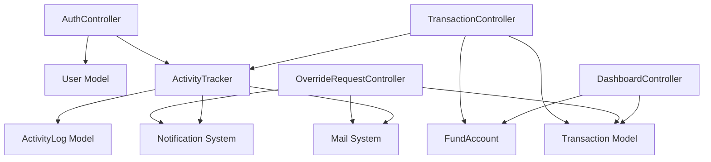

# IGCFMS Backend System Study & Analysis

## 🏗️ System Overview

**System Name:** Integrated Cashering  Management System (IGCFMS) Backend  
**Framework:** Laravel 12.x  
**Authentication:** Laravel Sanctum (Token-based)  
**Database:** MySQL  
**Architecture:** RESTful API with MVC Pattern  

---

## 📁 System Structure & File-by-File Analysis

### 🔐 **Authentication System**

#### `app/Http/Controllers/AuthController.php`
- **Role:** Handles authentication flow (login, logout, registration)
- **Key Functions:**
  - `login()`: Validates credentials, creates Sanctum tokens, tracks activity
  - `logout()`: Destroys tokens, tracks logout activity
  - `register()`: Creates registration requests (pending admin approval)
- **Dependencies:** User model, RegistrationRequest model, ActivityTracker service
- **Connections:** Email service for notifications to admin
- **⚠️ Potential Issue:** Email sending wrapped in try-catch but Log::error not imported

#### `app/Models/User.php`
- **Role:** Core user entity model
- **Fields:** name, email, password, role, department, phone, status
- **Relationships:** Through Laravel Sanctum for API tokens
- **Roles:** Collecting Officer, Disbursing Officer, Cashier, Admin

### 💰 **Fund Management System**

#### `app/Http/Controllers/FundAccountController.php`
- **Role:** Manages fund accounts (Revenue, Expense, Asset, Liability, Equity)
- **Key Functions:**
  - `index()`: Lists active fund accounts with computed balances
  - `store()`: Creates new accounts with auto-generated codes (REV001, EXP001, etc.)
  - `update()`: Updates account details
  - `destroy()`: Soft deletes or deactivates accounts with transactions
  - `updateBalance()`: Direct balance updates
- **Data Flow:** Computes current_balance from initial_balance + sum(transactions)
- **⚠️ Potential Issue:** Balance calculation happens on every request (not cached)

#### `app/Models/FundAccount.php`
- **Role:** Fund account entity with soft delete capability
- **Key Features:**
  - Auto-generates unique account codes by type
  - Soft deletes to preserve historical data
  - Relationships with transactions and users
- **Smart Logic:** `getNextAccountCode()` includes soft-deleted records to prevent code reuse

### 📊 **Transaction Processing**

#### `app/Http/Controllers/TransactionController.php`
- **Role:** Handles all financial transactions (Collections & Disbursements)
- **Key Functions:**
  - `index()`: Lists transactions with optional filtering by fund accounts
  - `store()`: Creates transactions with auto-generated receipt/reference numbers
- **Auto-Generation Pattern:**
  - Receipt: RCPT-YYYYMMDD-0001
  - Reference: COL-YYYY-0001 or DIS-YYYY-0001
- **Data Flow:**
  - Collections → positive amounts → creates receipt record
  - Disbursements → negative amounts → links to disbursement records
- **Dependencies:** FundAccount, Receipt, ActivityTracker

#### `app/Models/Transaction.php`
- **Role:** Transaction entity model
- **Relationships:** 
  - Belongs to FundAccount
  - Created by User
  - Approved by User
- **Fields:** type, amount, receipt_no, reference_no, mode_of_payment, etc.

### 💸 **Disbursement Management**

#### `app/Http/Controllers/DisbursementController.php`
- **Role:** Manages cash and cheque disbursements
- **Key Functions:**
  - `store()`: Creates disbursement with transaction linkage
  - `cheques()`: Lists all cheque disbursements
  - `show()`: Retrieves specific disbursement details
- **Transaction Flow:** Wraps operations in DB transactions for data integrity
- **Features:** Tracks issuer, approval, cheque details

### 🔄 **Override Request System**

#### `app/Http/Controllers/OverrideRequestController.php`
- **Role:** Manages transaction correction requests
- **Workflow:**
  1. Cashier submits override request with changes
  2. Email notification to admin
  3. Admin reviews (approve/reject)
  4. If approved, applies changes to original transaction
- **Security:** Only admins can review, cashiers see only their requests
- **⚠️ Issue:** Notification code partially commented out

### 📈 **Dashboard & Analytics**

#### `app/Http/Controllers/DashboardController.php`
- **Role:** Provides real-time analytics and metrics
- **Key Endpoints:**
  - `summary()`: Total users, funds, revenue, expenses
  - `dailyRevenue()`: 7-day revenue trend
  - `fundDistribution()`: Balance distribution across funds
  - `recentTransactions()`: Latest 10 transactions
  - `fundPerformance()`: Revenue vs expense by fund
- **⚠️ Performance Issue:** Multiple DB queries without caching

### 📝 **Activity Tracking & Auditing**

#### `app/Services/ActivityTracker.php`
- **Role:** Centralized activity logging service
- **Features:**
  - Tracks all user actions (login, logout, transactions, etc.)
  - Creates notifications for admins
  - Sends email alerts for critical activities
  - Records IP address and user agent
- **Activity Types:** 
  - Authentication events
  - Financial transactions
  - Override requests
  - User management
  - Fund account operations

#### `app/Models/ActivityLog.php`
- **Role:** Stores detailed activity records
- **Fields:** user_id, activity_type, description, ip_address, details (JSON)

### 🔔 **Notification System**

#### `app/Http/Controllers/NotificationController.php`
- **Role:** Manages in-app notifications
- **Functions:**
  - `index()`: Lists user notifications
  - `markAsRead()`: Updates notification status
  - `getUnreadCount()`: Returns unread notification count

### 📧 **Email System**

#### Mail Classes (app/Mail/*)
- **RegistrationApprovedMail**: User registration approval
- **RegistrationRejectedMail**: User registration rejection
- **OverrideRequestNotificationMail**: Override request alerts
- **ActivityNotificationMail**: Critical activity alerts
- **Configuration:** SMTP via Gmail (igcfmsa@gmail.com)

### 🛡️ **Middleware**

#### `app/Http/Middleware/HandleCors.php`
- **Role:** Manages Cross-Origin Resource Sharing
- **Configuration:** Allows requests from localhost:3000
- **Methods:** GET, POST, PUT, DELETE, OPTIONS
- **⚠️ Issue:** Hardcoded frontend URL (should use env variable)

### 🛣️ **Routing**

#### `routes/api.php`
- **Structure:**
  - Public routes: /login, /register, /health
  - Protected routes: All other endpoints require auth:sanctum
  - Route groups by feature (users, funds, transactions, etc.)
- **⚠️ Issue:** Duplicate route definitions for fund-accounts and override_requests

---

## 🧠 **System Purpose & Main Functions**

The IGCFMS backend is a **church fund management system** designed to:

1. **Track Financial Transactions**
   - Record collections (revenue/income)
   - Process disbursements (expenses/payouts)
   - Generate receipts and reference numbers

2. **Manage Fund Accounts**
   - Categorize funds (Revenue, Expense, Asset, Liability, Equity)
   - Track balances and transaction history
   - Department-wise fund allocation

3. **Ensure Accountability**
   - Role-based access control
   - Audit trail for all activities
   - Override request workflow for corrections

4. **Provide Analytics**
   - Real-time dashboards
   - Revenue trends
   - Fund performance metrics

---

## ⚙️ **Data Flow Architecture**

```
Frontend (React) 
    ↓ [HTTP Request with Bearer Token]
API Routes (routes/api.php)
    ↓ [Sanctum Middleware Authentication]
Controller Layer
    ↓ [Business Logic & Validation]
Service Layer (ActivityTracker)
    ↓ [Cross-cutting concerns]
Model Layer (Eloquent ORM)
    ↓ [Database Operations]
MySQL Database
    ↓ [Data Persistence]
Response Generation
    ↓ [JSON Response]
Frontend Render
```

### Transaction Flow Example:
1. **User submits collection** → TransactionController@store
2. **Validates input** → Creates transaction record
3. **Auto-generates** receipt/reference numbers
4. **Creates receipt** record in receipts table
5. **Tracks activity** via ActivityTracker
6. **Sends notification** to admins
7. **Returns JSON** response to frontend

---

## 🔗 **Module Dependencies**



---

## ⚠️ **Potential "Loading Forever" Issues**

### 1. **Missing Response Returns**
- **Location:** Some error conditions don't return proper responses
- **Impact:** Frontend waits indefinitely for response

### 2. **Uncached Database Queries**
- **Location:** DashboardController, FundAccountController@index
- **Issue:** Recalculates balances on every request
- **Solution:** Implement Redis caching or computed columns

### 3. **Email Sending Failures**
- **Location:** Multiple controllers with Mail::to()
- **Issue:** Synchronous email sending can timeout
- **Solution:** Queue email jobs

### 4. **Large Dataset Loading**
- **Location:** Transaction and activity log listings
- **Issue:** No pagination implemented
- **Solution:** Add pagination to prevent memory issues

### 5. **Database Transaction Locks**
- **Location:** DisbursementController@store
- **Issue:** Long-running transactions can cause deadlocks
- **Solution:** Optimize transaction scope

### 6. **CORS Preflight Issues**
- **Location:** HandleCors middleware
- **Issue:** OPTIONS requests might not be handled correctly
- **Impact:** Browser blocks requests, appears as loading

---

## 🔍 **Technical Insight Report**

### **Bottlenecks & Slow Points**

1. **Balance Calculation Performance**
   - Computing sum of all transactions for each fund account
   - No indexing on fund_account_id in transactions table
   - **Fix:** Add database index, implement caching

2. **N+1 Query Problems**
   - Dashboard endpoints load related data inefficiently
   - **Fix:** Use eager loading with `->with()` consistently

3. **Synchronous Operations**
   - Email sending blocks request processing
   - Activity tracking happens inline
   - **Fix:** Implement job queues

### **Missing/Incorrect Connections**

1. **Incomplete Notification Implementation**
   - Some notification code is commented out
   - Inconsistent notification creation

2. **Error Handling Gaps**
   - Not all controllers have try-catch blocks
   - Missing validation for edge cases

3. **Route Duplication**
   - Multiple definitions for same endpoints
   - Can cause unexpected behavior

### **Security Concerns**

1. **Hardcoded Values**
   - Frontend URL in CORS middleware
   - Admin email in multiple places
   - **Fix:** Use environment variables

2. **Missing Rate Limiting**
   - No throttling on login attempts
   - **Fix:** Implement Laravel's rate limiting

### **Optimization Recommendations**

1. **Implement Caching Strategy**
   ```php
   // Add to FundAccountController
   Cache::remember('fund_accounts', 3600, function() {
       return FundAccount::with('transactions')->get();
   });
   ```

2. **Add Database Indexes**
   ```sql
   ALTER TABLE transactions ADD INDEX idx_fund_account (fund_account_id);
   ALTER TABLE transactions ADD INDEX idx_created_at (created_at);
   ```

3. **Implement Job Queues**
   ```php
   // Convert email sending to queued job
   dispatch(new SendActivityNotification($activityLog));
   ```

4. **Add API Response Pagination**
   ```php
   // In TransactionController@index
   return Transaction::paginate(50);
   ```

5. **Fix CORS Configuration**
   ```php
   // Use env variable
   ->header('Access-Control-Allow-Origin', env('FRONTEND_URL'))
   ```

6. **Implement Request Validation Classes**
   ```bash
   php artisan make:request StoreTransactionRequest
   ```

7. **Add API Documentation**
   - Implement Swagger/OpenAPI documentation
   - Add PHPDoc comments to all methods

---

## 🚀 **Performance Enhancement Priority**

1. **HIGH:** Fix synchronous email sending (causes timeouts)
2. **HIGH:** Add pagination to prevent memory exhaustion
3. **MEDIUM:** Implement caching for frequently accessed data
4. **MEDIUM:** Add database indexes for query optimization
5. **LOW:** Clean up duplicate routes
6. **LOW:** Refactor hardcoded values to configuration

---

## 📌 **Conclusion**

The IGCFMS backend is a well-structured Laravel application with comprehensive financial management features. The main performance issues stem from:
- Lack of caching
- Synchronous operations that should be asynchronous
- Missing pagination on large datasets
- Inefficient database queries

Implementing the recommended optimizations would significantly improve response times and system reliability, eliminating the "loading forever" issues.
